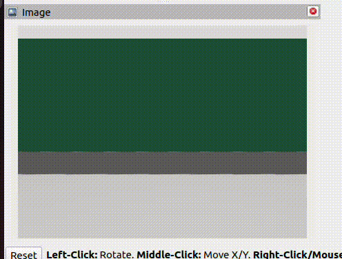

# 🤖 ROS2 Note – Task 3: Moving Robo Model and Simulation
*Akshai Krishna KP (CS24B1096)*

---

## 🎯 Goal

The goal was to make a **4-wheel differential drive robot** with **LIDAR** and **camera plugins**.  
We created the model using **URDF/Xacro**, visualized it in **RViz**, and simulated it in **Gazebo**.

---

## 📚 Learning Outcome Overview

> ✨ *This section summarizes what I learned this week about ROS2 Humble.*

---

### 📌 What I Learned

#### 1. Create Custom Robo Model in URDF/Xacro

- It was a fun way to make the model, and you can get creative with the design.
- Xacro is a simple tool to keep code clean and modular.
- **Reference**: [URDF/Xacro tutorial](https://docs.ros.org/en/humble/Tutorials/Intermediate/URDF/URDF-Main.html)


---

#### 2. Using RViz and `config.rviz` File

- That was the easy part at the start and helped with visualization.
- I used the package `urdf_tutorial` to visualize the model in RViz.
- **Reference**: [RViz2 tutorial](https://docs.ros.org/en/humble/Tutorials/Intermediate/RViz/RViz-Main.html)

---

#### 3. Using Gazebo

- I searched Google and found the original Gazebo documentation.
- Downloaded the most compatible version for ROS2 Humble, which is **Gazebo Fortress**:  
  [Installation Guide](https://gazebosim.org/docs/fortress/ros_installation/)
- Most of my friends downloaded **Gazebo Classic**, which has more community support.
- This made it hard to get help from them when I faced errors.

---

#### 4. Adding Plugins

- This was the hardest and most frustrating part of the task.
- Plugins differ between Gazebo versions — I referred to the official docs for each.

Plugins used:
```xml
<plugin filename="libignition-gazebo-sensors-system.so" name="ignition::gazebo::systems::Sensors"/>
<plugin filename="libignition-gazebo-camera-system.so" name="ignition::gazebo::systems::Camera"/>
<plugin filename="libignition-gazebo-diff-drive-system.so" name="ignition::gazebo::systems::DiffDrive"/>
```

- [Lidar & Camera Plugin Docs](https://gazebosim.org/docs/fortress/sensors/)
- [Diff Drive Plugin Docs](https://gazebosim.org/docs/fortress/moving_robot/)

---

#### 🎮 5. Control

I tried two methods and chose the easier one:

- **Method 1**: Add `TriggerPublisher` plugin to trigger responses from keyboard input.  
  ➤ [TriggerPublisher Example](https://gazebosim.org/docs/fortress/moving_robot/)

- **Method 2**: Use `teleop` — just 4 lines of code to achieve the same.  
  ➤ Obviously, I chose **teleop**.

---

#### 🛑 6. `safe_stopper` Node

- This was a tricky one.
- The challenge was understanding the `LaserScan` output — turned out it's just a matrix.
- Once I figured it out, I completed the node with GPT's help.
- For reference, there's an example node in the documentation:  
  ➤ [Obstacle Node](https://gazebosim.org/docs/fortress/sensors/)

---

#### 🚀 7. Launch File

- This part was **partially easy** and **partially tough**.
- I handled the **ROS-Gazebo bridging** in the launch file.
- The challenging part was figuring out **what to publish and where**.

---

#### 🧯 8. Errors and Debugging

- This was the **main learning outcome**.
- The only reason I still have a working laptop is because I found ways to manage frustration 😅.
- Solving one error often caused ten more to pop up unexpectedly.
- Most of my friends were using a different version of Gazebo, so they couldn’t help me much. 😞
- I ultimately failed in it, but was **Good Experience**.

---

## 📦 Current State

> In this section, I will show you the current state of the robot and output visuals.  
> ⚠️ Keep in mind: *My Robo is still incomplete.*


---

### ✅ Working Example

1. **LIDAR in Gazebo**


2. **Camera Output in RViz**



3. **Robot Movement**


---

### ❌ Issues

- Can't get LIDAR output in RViz, even though the `/scan` topic is publishing data.
- Movement in Gazebo isn't aligned with RViz visualization.

> These are the problems that are yet to be solved. I am currently working on it.

---

## 🛠️ How to Run

### 1. Install ROS Humble and Gazebo Fortress

- [ROS Humble Install Guide](https://docs.ros.org/en/humble/Installation/Ubuntu-Install-Debs.html)  
- [Gazebo Fortress Install Guide](https://gazebosim.org/docs/fortress/install/)

> ⚠️ *Ensure version compatibility.* I faced many problems due to mismatched versions.

---

### 2. Install Necessary Plugins and Packages
```Bash
sudo apt install ros-humble-ros-ign* ros-humble-ros-gz* ros-humble-xacro
```
```Bash
sudo apt install ros-humble-rviz2
sudo apt install ros-humble-robot-state-publisher
sudo apt install ros-humble-joint-state-publisher
sudo apt install ros-humble-teleop-twist-keyboard
sudo apt install ros-humble-tf2-ros
sudo apt install ros-humble-tf2
```

## 🛠️ Step 3: Create Workspace and Clone Repo

Follow these steps to create a ROS2 workspace and clone the repository:


```bash
mkdir ros_ws
cd ros_ws
git clone https://github.com/AkshaiKrishna-1096/Ros_Note.git
colcon build
```
- now we have made the workspace , install my repo inside it. and build it.

### 🚀 Step 4: Source and Launch

Once the workspace is built, run the following:

```bash
cd ~/ros_ws
source install/setup.bash
```
- now you are ready to launch
```bash
ros2 launch moving_robo final.launch.py
```

### ⚠️ Step 5: Possible Issues

- If you **don’t see the LIDAR rays** in Gazebo, scroll down the right panel and click **refresh**.
- If the **robot model doesn't appear in RViz**, make sure the **fixed frame** is set to `base_link`.
- To move the robot, **select the small xterm window** and press keys.

---

## 📝 Conclusion Note

- This was an **awesome experience**, but I wasn’t able to complete the task exactly how I intended.
- I’m still working on it — so if you don’t see the issues mentioned above, it likely means I’ve **fixed them and pushed the updates**. 😄
